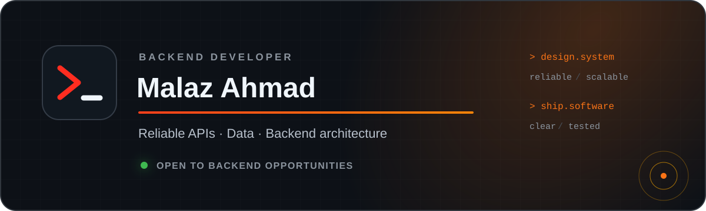
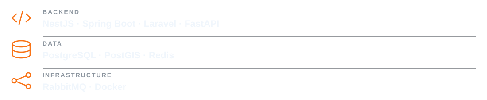

  

  <a href="https://malaz-3301.github.io/portfolio/">Portfolio</a>
  &nbsp;·&nbsp;
  <a href="https://www.linkedin.com/in/malaz-ahmad/">LinkedIn</a>
  &nbsp;·&nbsp;
  <a href="mailto:malaz.ahmad.2027@gmail.com">Email</a>
  &nbsp;·&nbsp;
  <a href="https://t.me/malaz_e">Telegram</a>

 

I build reliable backend systems with a focus on **clean APIs, data integrity, and maintainable architecture**.

### Engineering focus

- API and backend module design
- Relational and geospatial data, caching, and concurrency
- Security, testing, documentation, and containerization

### Working with

  

> Good backend engineering is not only about making a request succeed. It is about keeping the system understandable when traffic, data, and requirements grow.

  Explore the repositories below for implementation details, or visit the portfolio for a guided overview.

