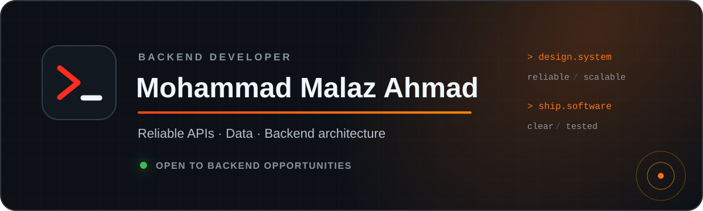

  

  <a href="https://malaz-3301.github.io/portfolio/">Portfolio</a>
  &nbsp;·&nbsp;
  <a href="https://www.linkedin.com/in/malaz-ahmad/">LinkedIn</a>
  &nbsp;·&nbsp;
  <a href="mailto:malaz.ahmad.2027@gmail.com">Email</a>
  &nbsp;·&nbsp;
  <a href="https://t.me/malaz_e">Telegram</a>

 

I build backend systems where **correctness, data, and architecture** matter. My work centers on reliable APIs, database behavior, maintainable application structure, and the tests that keep those pieces dependable.

I am also a fifth-year Information Engineering student at Damascus University, specializing in Artificial Intelligence. I use AI and NLP when they solve a real product problem—not simply to add another tool to the stack.

### Engineering focus

- Designing clear API contracts and backend modules with focused responsibilities
- Working with relational and geospatial data, caching, and concurrent operations
- Applying authentication, authorization, validation, and performance testing
- Making services documented, testable, and reproducible

### Working with

  

> Good backend engineering is not only about making a request succeed. It is about keeping the system understandable when traffic, data, and requirements grow.

  Explore the repositories below for implementation details, or visit the portfolio for a guided overview.

